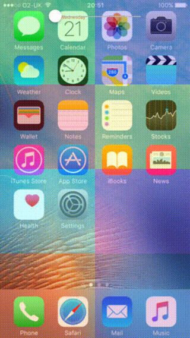

# VisualEffectView

[](http://twitter.com/lasha_)
[](http://cocoapods.org/pods/VisualEffectView)
[](https://travis-ci.org/efremidze/VisualEffectView)
[](https://codebeat.co/projects/github-com-efremidze-visualeffectview)

[UIVisualEffectView](https://developer.apple.com/library/ios/documentation/UIKit/Reference/UIVisualEffectView/) subclass with tint color. Applies a blurring effect to the content layered behind using [UIBlurEffect](https://developer.apple.com/library/ios/documentation/UIKit/Reference/UIBlurEffect_Ref/index.html#//apple_ref/occ/cl/UIBlurEffect).



```
$ pod try VisualEffectView
```

## Installation
###CocoaPods
To install with [CocoaPods](http://cocoapods.org/), simply add this in your `Podfile`:
```ruby
use_frameworks!
pod "VisualEffectView"
```

###Carthage
To install with [Carthage](https://github.com/Carthage/Carthage), simply add this in your `Cartfile`:
```ruby
github "efremidze/VisualEffectView"
```

### Manually
1. Download and drop ```VisualEffectView.swift``` in your project.  
2. Congratulations!  

## Usage

Create a VisualEffectView using the empty initializer.

```swift
import VisualEffectView

let visualEffectView = VisualEffectView()
addSubview(visualEffectView)
```

### Customization

```swift
var colorTint: UIColor // tint color
var colorTintAlpha: CGFloat // tint color alpha
var blurRadius: CGFloat // blur radius
var scale: CGFloat // scale factor
```

## Contributions

Contributions are totally welcome.

## License

VisualEffectView is available under the MIT license. See the LICENSE file for more info.

## Disclaimer

VisualEffectView utilizes a private UIKit API to do its magic. Use caution, submitting this code to the App Store adds the risk of being rejected!

## Credits

https://github.com/collinhundley/APCustomBlurView
