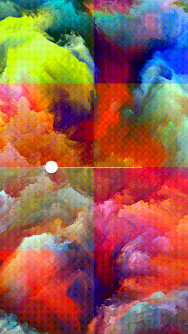

[UIVisualEffectView](https://developer.apple.com/library/ios/documentation/UIKit/Reference/UIVisualEffectView/) subclass with tint color. Applies a blurring effect to the content layered behind using [UIBlurEffect](https://developer.apple.com/library/ios/documentation/UIKit/Reference/UIBlurEffect_Ref/index.html#//apple_ref/occ/cl/UIBlurEffect).

[](https://swift.org)
[](http://cocoapods.org/pods/VisualEffectView)
[](https://travis-ci.org/efremidze/VisualEffectView)
[](https://codebeat.co/projects/github-com-efremidze-visualeffectview)



```
$ pod try VisualEffectView
```

## Requirements

- iOS 8.0+ / macOS 10.10+ / tvOS 9.0+ / watchOS 2.0+
- Swift 3.0 (VisualEffectView 2.x), Swift 2.3 (VisualEffectView 1.x)

## Installation
###CocoaPods
To install with [CocoaPods](http://cocoapods.org/), simply add this in your `Podfile`:
```ruby
use_frameworks!
pod "VisualEffectView"
```

###Carthage
To install with [Carthage](https://github.com/Carthage/Carthage), simply add this in your `Cartfile`:
```ruby
github "efremidze/VisualEffectView"
```

### Manually
1. Download and drop ```VisualEffectView.swift``` in your project.  
2. Congratulations!

## Usage

Use the VisualEffectView like any UIView.

```swift
import VisualEffectView

let visualEffectView = VisualEffectView(frame: CGRect(x: 0, y: 0, width: 320, height: 480))

// Configure the view with tint color, blur radius, etc. For example:
//
// visualEffectView.colorTint = .redColor()
// visualEffectView.colorTintAlpha = 0.2
// visualEffectView.blurRadius = 10
// visualEffectView.scale = 1

addSubview(visualEffectView)
```

For more examples, take a look at the example project.

### Customization

```swift
var colorTint: UIColor // tint color
var colorTintAlpha: CGFloat // tint color alpha
var blurRadius: CGFloat // blur radius
var scale: CGFloat // scale factor
```

### Storyboard Support

Works great with storyboards and xibs.

## Disclaimer

VisualEffectView utilizes a private UIKit API to do its magic. Use caution, submitting this code to the App Store adds the risk of being rejected!

## Credits

https://github.com/collinhundley/APCustomBlurView
